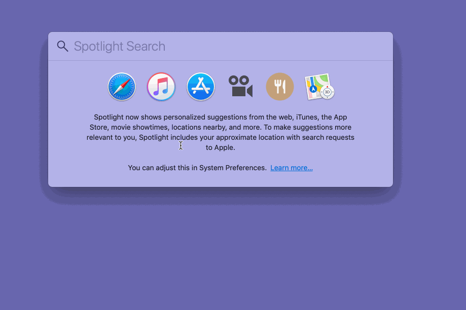

# LaptopTwo

The purpose of this script is to set up a macOS computer for web/software development, primarily at 18F/TTS/GSA. 

This can be safely run multiple times.

## Requirements

The script installs what it needs to do what it does. 

## Testing

This has been tested on:

* [macOS Mojave 10.14](https://www.apple.com/osx/)

## Installing and Running

Begin by opening the Terminal application on your Mac. The easiest way to open
an application in OS X is to search for it via [Spotlight]. The default
keyboard shortcut for invoking Spotlight is &#8984;-Space (or, hold the command key and press space). 



Once Spotlight
is up, just start typing the first few letters of the app you are looking for,
and once it appears, press `return` to launch it.

In your Terminal window, copy and paste the command below, then press `return`.

```sh
bash <(curl -s https://raw.githubusercontent.com/18F/laptoptwo/master/bootstrap.sh)
```


The animation above accelerates the script's execution time; in reality, it takes several minutes.

You will be asked to enter your OS X password at various
points (for example, to install the macOS developer tools). This is the same password that you use to log in to your Mac. Your password is not captured or stored in any way.

**Once the script is done, make sure to quit and relaunch Terminal.**

## What It Does

The script first installs `homebrew`, a tool that manages the installation of software packages, particularly open software you will find useful when doing development. It then installs [Ansible](https://www.ansible.com/) to automate setup tasks. Ansible is often used in the context of server setup and automation, making it an appropriate tool for setting up your macOS laptop.

## Contributing

There are a few great ways to contribute:

1. If something doesn't work, post an issue on the GitHub repos.
2. If something could work better, post an issue.
3. If you think something should become part of the default setup, post an issue.
4. If you want to add a new feature, consider adding a new [role](https://docs.ansible.com/ansible/latest/user_guide/playbooks_reuse_roles.html).

The setup script makes use of Ansible "roles." In this script, we're using each role to capture a different aspect of the setup process. For example, the [install](roles/install) role automates all of the package installations and updates via `homebrew`. The [gpg](roles/gpg) role configures GPG, which requires a bit of tweaking on macOS (as opposed to Linux). It might be that your contribution extends or modifies an existing role, or perhaps it adds a whole new role (because your contribution does something new). Either way, either open an issue to discuss the contribution, or make a pull request for review!

See [CONTRIBUTING](CONTRIBUTING.md) for more information.

## Rationale, Vision, Governance, and More

See [the rationale document](RATIONALE.md) for more. It has all the other things.
